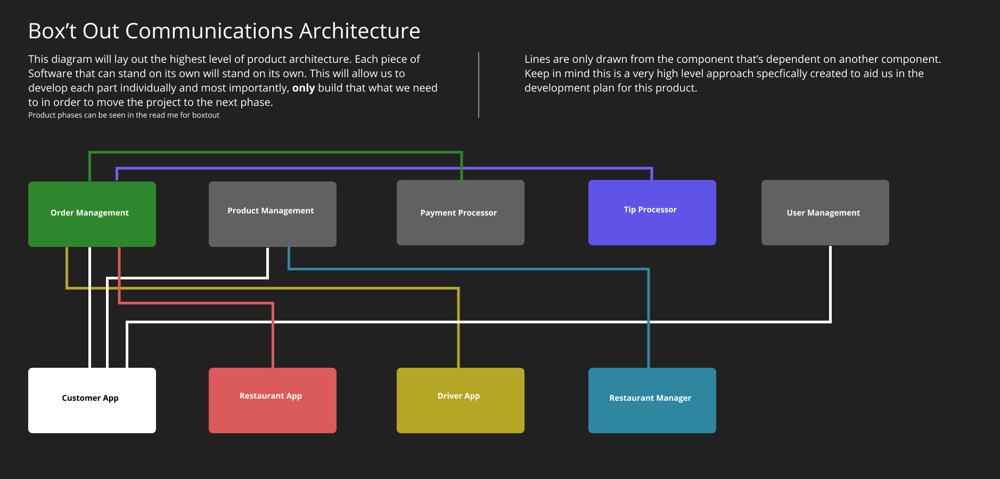

# BoxtOut Highlevel Overview

In this document I will detail the product that we’ll be building on the FilledStacks YouTube channel in order to show the actual process behind building a complete product. Given that it will be an actual product it will take a very long time to complete. The goal of this project is to show developers that might not have worked on something of this size why we want to make better decisions when it comes to state management or architecture. And also why it’s important to stick to principles and guidelines even if it sometimes means longer turnover time for short term development implementations.

## Introduction

What we’ll be building is a Product called BoxtOut - Pronounced Boxed Out. which is a play on Boxing a meal and sending it Out to a Customer. I know, not very creative, but I promise I’ll be more creative when it comes to the product itself. It will be a complete food delivery product that I will be building completely open source and providing tutorials along the way for all the functionality built in the app.

The reason I chose a Food delivery app is because:

1. We just delivered a rebuild of the 2 out of 3 user facing applications for a client of ours that manages a food delivery product and service. This gave me insights into how we can rebuild a more efficient and cost effective one using some of the tools available to a single full stack dev like myself or a small team, like the one we have.

2. It ensures that you actually see how important it is to understand higher level architectural planning to deliver a product, not just a single mobile app, a full product.

3. It has multiple pieces of software to build to have an efficient system so it’s an opportunity to cover software building from many angles.

## Products Overview

Let's look at what we’ll require at minimum to build this product and have it be useful as a product. We’ll go through the process that I use to go through and quote for a new project when a client reaches out to me. We’ll work our way from the app through the entire system and then make a list of each of those items. We’ll start with the most important. Each of the descriptions will have a bold word which indicates something else that needs to be built.

### Customer Mobile Application

This is the application that the customer will be using to order their food. To have a customer we need a way to manage all the users infomation. So we need a **User Manager**. In addition to that, if we want to order we need a **backend to manage orders**. We’ll build that using Firestore DB in the Firebase suite. But before the user can place any order they need to be able to choose a product. So the **backend should also store all the products**, we’ll use Firestore DB for that as well. But where do these products come from and who do they belong to? Well, we’ll need a **Restaurant manager** to allow restaurants to manage their own menu’s, opening times, locations and general information.

But before we can even capture that order we need to take payment. So we’ll need to build a **payment system** that can process credit card payments, attach receipts and make sure that there’s no faulty transactions on the orders.

So now we have the information that will be shown in the app through the Restaurant manager, all that information is stored on the backend Firestore DB. When the user places an order on the Customer app it goes into our order management backend system which will be built using firebase functions and the order is placed. Now what?

### Restaurant Application

This application goes into the Restaurant that’s signed up to our service so they can manage it from there. This application will be connected to our backend to manage orders for the specific restaurant. They will be able to select an order and indicate to us how long it’ll take to complete, then they’ll be able to mark it ready for when the driver can pick it up. So this application will be solely for the restaurant to give updates to the customer that ordered the meal. Did I just say driver? Well how will they know what’s happening. That’s where the **Driver app** comes in.

### Driver Application

This application is specifically designed for the drivers. It’s to notify them if they have an order to pick up. They will get a firebase notification which will tell them there’s an order up for grabs in their area. They can then accept the order which will be assigned to them and they will get the locations of where to pick up and where to drop off. The driver app will complete the order process and mark the order as delivered and completed. What about the drivers tip?

Well the tip is sent from the customer app in the order but we’ll have to process that and when the driver has delivered we’ll assign that tip to their account for payout at the end of the month. For that we’ll need some specific functionality for **Tip processing**. Lets tally up everything mentioned above that has to be built.

### Backend to manage orders

Since everything will be done on Firebase, each of the “backend” systems will be a serverless set of cloud functions that we’ll deploy to manage these parts for us. The order management system will be a set of serverless functions that will focus only on managing the orders. It will take the order in, send the required information to the payment processor, send the information to the tip processor, Add the order into the DB, update the order status accordingly and send out the appropriate notifications.

### Backend to manage products

This set of serverless functions will be dedicated to the management of products and menus from Restaurants. It will store the products as added by the restaurant manager, and allow the applications to query it. This backend will be readonly to the client applications and will be populated completely using the Restaurant management system.

### Restaurant Management System

This application will be used by restaurants or the sales representatives to upload the restaurant products and create their menu’s. We will be able to update opening times, product availability, product images, product options, etc.

### Payment Processor

This piece is separate because I think it's important to focus on directly and make sure it's rock solid.

### Tips Processor

This part can be apart of the Payment processing but I think we'll keep it separate in terms of the code management incase we introduce certain functionalities around that.

### User Manager

This service will manage all the functionality and data relating to the user. Some things to mention will be to update user information, store the user data, provide functionality for any kind of credit or reward system, store coupons used, etc. Anything relating to the user will be done by this service

That puts us at a total of 9 pieces of software to be built. Not small at all, as you’ll see when we tackle each of these parts, they will all have their own internal architecture setup to make sure they fit well into the overall product architecture.

## Product Architecture

Let's take a quick look at how we intend to build up the product architecture. This will give us a clear picture of what is dependent on which parts which will eventually lead us to a development plan to start the creation of this system.

Lets go over the graph above breaking each dependency down per component / piece of software. We'll go over each part in order of importance in the dependency graph

### Order Management

Order management is depended on by the three User facing applications. In this case our users are Customers, Restaurants and Drivers. They all depend on the Order Management system, or at least a part of it (more on these parts when we break down the system itself). This system is in itself dependent on the Payment Processor. This is a hard dependency because in order for use to actually place an order, the payment processor has to give us the green light before we execute any other logic. This we'll most likely build a stub interface for so that we can continue with development without taking actual orders.

### Product Management

Product Management is dependent on by only the Customer App and the Restaurant Manager. The customer apps is relationship with the Product Management is a read-only relationship. In that sense it's more dependent on the Database to have product / restaurant information. But for now we will put it's dependency into the Product Management bucket. We can break that down more technically in the technical planning episode and break down. The Restaurant Manager has a more traditional dependency on the Product Management system. The Product management is required to exist or be developed at the same time (slight lead) as the Restaurant Manager. The Restaurant Manager is the system that will put the information into the Product Management database.

### User Management

Everything else has a smaller dependency Footprint than the two above. The user management is dependent on by the Customer App only since that's where the user will be communicating to us on the information they want to store.

### Payment Processor

This processor is depended on by only the Order Management system. When orders are placed we will first process the payment and then continue with the order placement. This can be mocked out for now to allow for a more rapid development pace.

### Customer App

The customer app has no dependencies on it, but it depends heavily on multiple backend software to have been developed, or at leas stubbed out. It need to read all the product information (so we'll need products), it needs to be able to place an order (we'll need the order management) and it needs to be able to sign up a User (user management).

### Restaurant App

The restaurant app only depends on the Order Management system. This makes it quite a nice playground for rapid development due to the lack of dependencies.

### Driver App

Only dependent on the Order Management as well. We need some basic functionalities from the Order Management in order for this app to work. More on that in the technical break down.

### Restaurant Manager App

This app is dependency on the Product Management, but it's purpose can be served without needing a UI. We can fill the data into a spread sheet and read it into the database using a cloud function. So it's very low on the dependency graph.

The order of the product pieces written down above is the order of importance of the development. BUT, that still does not mean that we have to develop the entire part for the functionality to be complete. More of that is explained in the phases below.

## Development Phases

This section describes the phases of development where we will have "Major" version releases. A product of this size is never built in one go, in fact, the separate components as shown above is not even built to completion in any phase. We've moved away from Waterfall a while back and the most successful software companies do incremental work / updates given we're almost the only field in engineering that can do that without any additional cost. We'll have multiple phases marked by specific functionality being in that phase which will give us a nice break down of what to work on in order to complete the development of this application.

The phases are all dependent on the architecture dependency graph you see above, the parts with the most dependencies will most likely be built first so we can allow for multiple other parts to be worked on as well. Lets go over a basic high level view of some of the phases.

### Phase 0: Technical architecture overview and technology stack setup

This is the high level technical phase of the planning that was done above. We need to establish how we will be building these management services, how they will be deployed, how the source code will be managed and how we plan on extending functionality / deprecating older functionality. This is an important part since the services will be the major feature of the product. We are skilled at developing client applications, and stacked is our preferred architecture, with this planning we'll need to setup the backend in such a way that it's easy to unit test, easy to deploy, easy to manage, easy to update and easy to debug in the live production state.

This phase will be concluded when we have a detailed plan of the technical setup and technical architecture overview as well as the deployment and technology stack overview.

### Phase 1: Basic data storage structure and models involved

In this phase we want to go over all the functionality we're looking at adding into the app. This will illuminate the models that we'll require to build all the services. We will identify key models and decides on which properties will be useful to have in the application.

A success for this phase will be a detailed breakdown of the models we'll have in the application as well as the purpose they serve, their properties and in which parts of the system they will be used.

### Phase 2: Data population and development prep

In this phase we are still not writing code haha. Planning and structure is important for such a large system, and we're still going to miss things. Here we will use the models defined above and generate some fake data for use to use when we finally do start the development. This process will give us a first review of our database structure we defined above and will show any flaws that we might have made in terms of how to store everything. This will also be very helpful during the development to ensure that we have data to work it.

A success for this phase will be a database with enough information in it to allow us to display some basic product when we get to that point.

### Phase 3: Customer App Setup and Authentication

Here we will create the mobile flutter project and setup firebase authentication. We will also make sure that when a user signs up we create them a profile on the database where we can manage all their information. This will be profile information for us to identify who we're communicating with.

A success for this phase will be a flutter app where we can sign in. A folder with a firebase project for user management that contains the cloud function to create a new user model entry in firestore when the user is created. A firebase app setup to allow for authentication.

### Phase 4: Which restaurants do we show?

Usually in food delivery service it only shows you restaurants that's in a 10 - 20 km radius. We need to build that system first before we can show any restaurants to the user. For this we'll be using gmaps to get the users address and then use that locally to calculate which restaurants to show.
